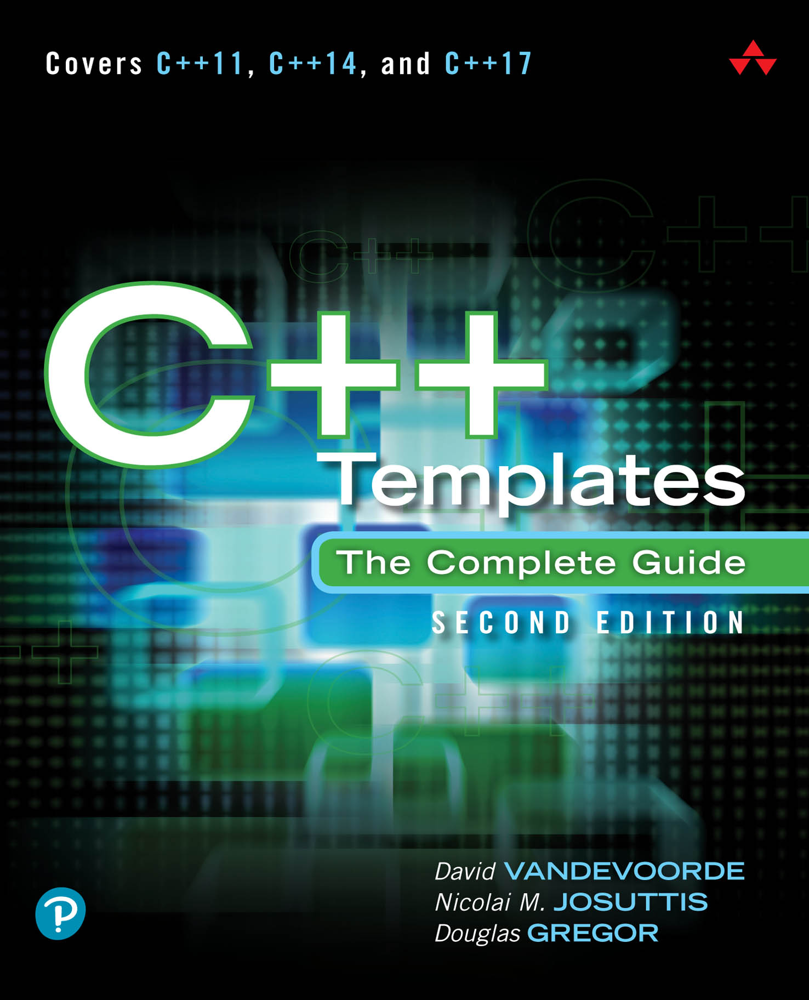

# C++ Templates

*Second Edition*

* 作者：David Vandevoorde，Nicolai M. Josuttis，Douglas Gregor
* 译者：陈晓伟
* 首次发布时间：2017年9月8日([来源](https://www.amazon.com/C-Templates-Complete-Guide-2nd/dp/0321714121))

> 翻译是译者用自己的思想，换一种语言，对原作者想法的重新阐释。鉴于我的学识所限，误解和错译在所难免。如果你能买到本书的原版，且有能力阅读英文，请直接去读原文。因为与之相较，我的译文可能根本不值得一读。
>
> 
 — 云风，程序员修炼之道第2版译者

PDF可在本库的[Release页面](https://github.com/xiaoweiChen/Cpp-Templates-2nd/releases)获取。

## 本书概述

模板是C++中一个强大的特性，但对模板的误解，并未随着C++语言和开发社区的发展而消弭，从而无法使模板无法发挥其全力。本书的三位作者，同时作为C++专家，展示了如何使用现代模板来构建干净、快捷、高效、容易维护的软件。

第二版对C++11、C++14和C++17标准进行了更新，对改进模板或与模板交互的特性进行了解释，包括可变参数模板、泛型Lambda、类模板参数演绎、编译时if、转发引用和用户定义文字。还深入研究了一些基本的语言概念(比如值类别)，并包含了所有标准类型特征。

本书从基本概念和相关语言特征开始，其余部分作为参考。先关注语言，再是编码、高级应用程序和复杂的惯用法。过程中，示例清楚地说明了抽象概念，并演示了模板的最佳实践。

#### 关键特性

- 准确理解模板的行为，避免陷阱

- 使用模板编写有效、灵活、可维护的软件

- 掌握有效的习语和技巧

- 保持性能或安全的情况下重用源码

- C++标准库中的泛型编程

- 预览即将发布的“概念"特性

  

## 适读人群

如果您是使用C++的开发人员，想要学习或复习模板，请仔细阅读第1部分。即使已经非常熟悉模板，快速浏览这一部分也有助于熟悉本书使用的编程方式和术语。该部分也涵盖了如何组织模板相关代码的内容。

可以按自己喜欢方式学习。第2部分中有模板更多的许多细节信息，也可以在第3部分中阅读实用的编码技术(并参考第2部分了解相关的语言问题)。如果阅读这本书是为了应对开发中的具体问题，那么后一种方法可能有助于问题的解决。

附录包含了许多在正文中经常提到的信息，我们也试图让其变得更有趣。

根据经验，学习新东西的最好方法是看例子。因此，可以在本书中找到大量的例子。有些只是用几行代码解释一个抽象概念，而另一些是具体应用的完整源码。后一种示例将通过注释来说明需要包含程序代码的文件。可以在这本书的网站<http://www.tmplbook.com>上找到这些文件。

## 作者简介

**David Vandevoorde**在20世纪80年代后期开始用C++编程。从伦斯勒理工学院获得博士学位后，成为惠普C++编译器团队的技术负责人。1999年，加入了爱迪生设计集团(EDG)，该集团的C++编译器技术是业界领先的。他是C++标准委员会的活跃成员，也是comp.lang.c++新闻组的主持人(参与创办)。也是《C++ Solutions》的作者，该书是《C++ Programming Language, 3rd Edition》的配套书籍。

**Nicolai M. Josuttis**因其畅销的标准书籍《The C++ Standard Library - A Tutorial and Reference》而闻名于世，是一名独立技术顾问，为电信、交通、金融和制造业设计面向对象的软件。也是C++标准委员会的活跃成员，也是System Bauhaus的合伙人，System Bauhaus是一个由面向对象系统开发专家组成的德国团体。Josuttis还写过其他几本关于面向对象编程和C++的书。

**Douglas Gregor**是苹果公司的高级Swift/C++/Objective-C编译工程师，拥有伦斯勒理工学院的计算机科学博士学位，并在印第安纳大学从事博士后工作。

## 本书相关

* github地址：<https://github.com/xiaoweiChen/Cpp-Templates-2nd>
* 译文的LaTeX 环境配置：<https://www.cnblogs.com/1625--H/p/11524968.html>
* vscode中配置latex：<https://blog.csdn.net/Ruins_LEE/article/details/123555016>
* 开源示例：<https://github.com/downdemo/Cpp-Templates-2ed>
* 开源翻译：

  * <https://github.com/Walton1128/CPP-Templates-2nd-->
  * <https://github.com/r00tk1ts/cpp-templates-2nd>
  * <https://www.zhihu.com/column/c_1397602018500890624>

